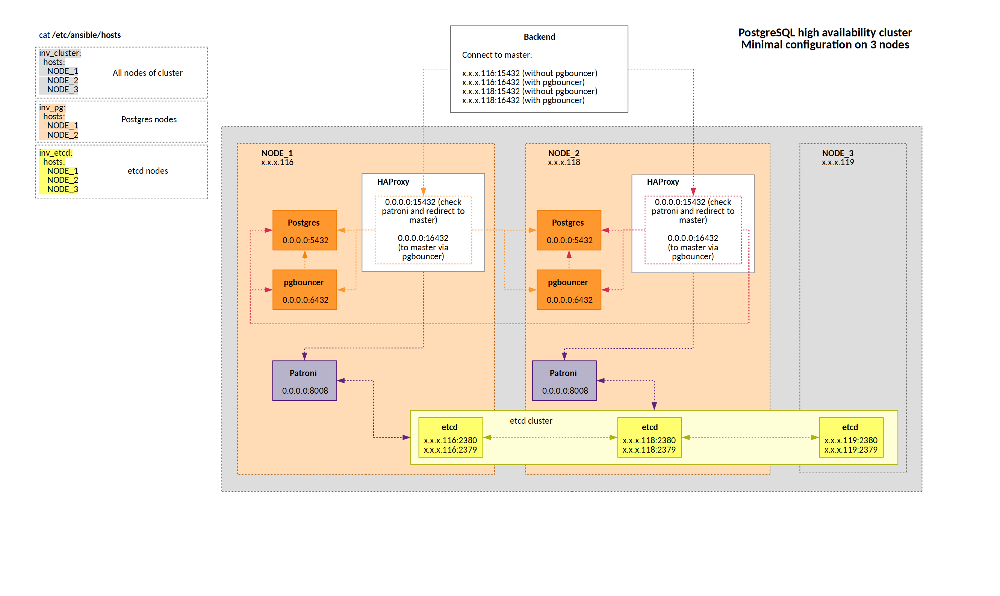
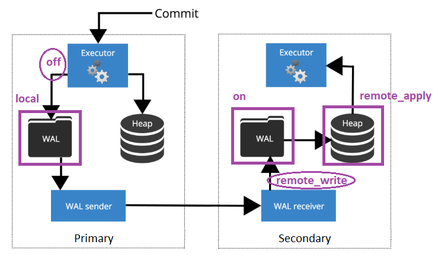

# pg_cluster

PostgreSQL high availability cluster on Patroni

## Terminology

**Promote** - change role of PostgreSQL instance `Secondary -> Primary`  
**Demote** - change role of PostgreSQL instance `Primary -> Secondary`  
**Failover** - promote `Secondary` when `Primary` is failed  
**Swithover** - swap roles (manual process)  
**Failback** - restore failed `Primary` in `Secondary` role  

## Requirements

- Ansible 2.9
- Ubuntu 18.04 (bionic)

## Project structure

```
|-- defaults
|   `-- main.yml				# Default settings for: patroni, haproxy, pgbouncer
|-- pg-cluster.yaml			# Main playbook
|-- pki-dir				# Certificates generated using ssl-gen.sh
|   |-- ca-key.pem
|   |-- ca.pem
|   |-- ...
|-- README.md
|-- roles
|   |-- etcd					# v3.3.18
|   |   |-- defaults
|   |   |   `-- main.yml
|   |   |-- handlers
|   |   |   `-- main.yml
|   |   |-- tasks
|   |   |   |-- main.yml
|   |   |   |-- pki.yml
|   |   |   `-- systemd.yml
|   |   |-- templates
|   |   |   |-- etcd.conf.j2
|   |   |   `-- etcd.service.j2
|   |   `-- vars
|   |       `-- main.yml
|   |-- haproxy					# v1.8.8
|   |   |-- tasks
|   |   |   `-- main.yml
|   |   `-- templates
|   |       `-- haproxy.cfg.j2
|   |-- patroni					# v1.6.4
|   |   |-- handlers
|   |   |   `-- main.yml
|   |   |-- tasks
|   |   |   `-- main.yml
|   |   `-- templates
|   |       |-- patroni.service.j2
|   |       |-- patroni-watchdog.service.j2
|   |       `-- patroni.yml.j2
|   |-- pgbouncer				# v1.12.0
|   |   |-- sql
|   |   |   `-- pgbouncer_prepare.sql	# CREATE SCHEMA pgbouncer and FUNCTION pgbouncer.get_auth
|   |   |-- tasks
|   |   |   `-- main.yml
|   |   `-- templates
|   |       |-- pgbouncer.ini.j2
|   |       `-- pgbouncer.service.j2
|   |-- postgres				# v12.X
|   |   `-- tasks
|   |       `-- main.yml
|   `-- prepare_nodes			# Role for installing basic utils
|       `-- tasks
|           `-- main.yml
|-- tools
|   |-- etcd
|   |-- etcd.conf
|   `-- ssl-gen.sh
`-- vars
	`-- main.yml		# Repo and modules for patroni and postgres
```




## Installation

Prepare deployment node:

```bash
sudo apt-get update
sudo apt-get upgrade -y
sudo apt-get install -y golang-cfssl
sudo apt-get install python tree -y
sudo apt install software-properties-common
sudo apt-add-repository --yes --update ppa:ansible/ansible
sudo apt install ansible
ansible --version
>> ansible 2.9.2
```

Create ssh-key for ansible:

```bash
ssh-keygen
# push public key on nodes: NODE_1, NODE_2, NODE_3 (cluster nodes)
cat > ~/.ssh/authorized_keys << EOL
ssh-rsa AAAAB3NzaC1yc2EAAAADAQABAAABAQDIDYbEAunHBDCL39ZoSt+F73jb9ufh/b0ml+FRFmsT8WzyNY2IJfvVb8kTCV+n9RI0m8eBrIZY90yDNFHvTVQAgnvAPnsSrEuBCrLFz1RuvIZ9uOuFXN+l4f9yjqIVaNldKl+rXe/6IXYD790bRyiwuv9QvpkAjKJhR+r+8+no/vcfdVZlq8ppq7lCj+UKlCFGG/VA67ghgOgTMT2cjekJFMkNUfXbXn7YExgRf0An4NZNusV/9EW7PkTISLwgPcI1Bof3CFhfTXbR6NmUfloNO2lr+bUXmBEJWKm4sE67N4gqBKtN8PaOi/9wX3oCQdFQmL3Egq/86l1P7l74Tw0d root@ansible_node
EOL
```

Configure python on cluster nodes:

```bash
ln -s /usr/bin/python3 /usr/bin/python
```

Configure inventory file:

```bash
cat > /etc/ansible/hosts << EOL
inv_cluster:
  hosts:
	NODE_1:
	  ansible_ssh_host: 185.246.65.116
	NODE_2:
	  ansible_ssh_host: 185.246.65.118
	NODE_3:
	  ansible_ssh_host: 185.246.65.119
inv_pg:
  hosts:
	NODE_1:
	  ansible_ssh_host: 185.246.65.116
	NODE_2:
	  ansible_ssh_host: 185.246.65.118
inv_etcd:
  hosts:
	NODE_1:
	  ansible_ssh_host: 185.246.65.116
	NODE_2:
	  ansible_ssh_host: 185.246.65.118
	NODE_3:
	  ansible_ssh_host: 185.246.65.119
EOL
```

Test ansible connection:

```bash
# on NODE_DEV
export ANSIBLE_HOST_KEY_CHECKING=False		# to avoid  WARNING: REMOTE HOST IDENTIFICATION HAS CHANGED!
# or clear the contents of known_hosts
> ~/.ssh/known_hosts
# test connection
ansible -m ping inv_cluster
```

Generate etcd keys:

```bash
cd tools
# format of etcd.conf: <external-DNS>,<external-IP>,<AWS-internal-DNS>,<AWS-internal-IP>
cat > etcd.conf << EOL
NODE_1,185.246.65.116,NODE_1,185.246.65.116
NODE_2,185.246.65.118,NODE_2,185.246.65.118
NODE_3,185.246.65.119,NODE_3,185.246.65.119
EOL
./ssl-gen.sh etcd.conf
cd ..
```

Deploy cluster:

```bash
ansible-playbook pg-cluster.yaml
```

Deploy specific role:

```bash
ansible-playbook pg-cluster.yaml --tags "postgres"
# prepare_nodes, etcd, pgbouncer, haproxy
```

After `CREATE DATABASE db_x` to allow the pgbouncer connections run:

```bash
su - postgres -c "psql -A -t -d db_x -f /etc/pgbouncer/pgbouncer_prepare.sql"
```

## How to

Work with etcd:

```bash
# on NODE_1
e_host=(--endpoints https://185.246.65.116:2379 \
	--ca-file=/var/lib/etcd/pg-cluster.pki/ca.pem \
	--cert-file=/var/lib/etcd/pg-cluster.pki/NODE_1.pem \
	--key-file=/var/lib/etcd/pg-cluster.pki/NODE_1-key.pem \
)

etcdctl "${e_host[@]}" --debug cluster-health

# list etcd members
etcdctl "${e_host[@]}" --debug member list

# check version
etcdctl "${e_host[@]}" --version
>> etcdctl version: 3.3.18
>> API version: 2

# show all directories
etcdctl "${e_host[@]}" ls --recursive --sort -p /service

# get key value ("main" is "patroni_scope")
etcdctl "${e_host[@]}" get /service/main/config

# cleanup patroni cluster configuration
etcdctl "${e_host[@]}" rm /service/main --recursive
```

Manual start patroni:

```bash
ps -ef | grep "bin/patroni" | grep -v grep | awk '{print $2}' | xargs kill
su -l postgres -c "/usr/bin/python3 /usr/local/bin/patroni /etc/patroni/NODE_1.yml"
```

Reinstall patroni cluster (for the playbook debugging purposes only):

```bash
# on each node
node_n=NODE_1
e_host=(--endpoints https://185.246.65.116:2379 \
	--ca-file=/var/lib/etcd/pg-cluster.pki/ca.pem \
	--cert-file=/var/lib/etcd/pg-cluster.pki/$node_n.pem \
	--key-file=/var/lib/etcd/pg-cluster.pki/$node_n-key.pem \
)
ps -ef | grep -we "patroni\|postgres" | grep -v grep | awk '{print $2}' | xargs kill -9 || true && \
rm -rf /var/lib/postgresql/12/main && \
rm -rf /etc/patroni && \
etcdctl "${e_host[@]}" rm /service/main --recursive
# etcdctl "${e_host[@]}" rmdir /service/main
# on deployment node
ansible-playbook pg-cluster.yaml --tags "postgres"
ansible-playbook pg-cluster.yaml --tags "patroni"
```

Manual create user:

```bash
# create user
su - postgres -c "psql -A -t -d postgres -c \"CREATE ROLE replicator WITH REPLICATION LOGIN PASSWORD 'repuserpasswd'\""
# check user
su - postgres -c "psql -A -t -d postgres -c \"select * from pg_roles where rolname = 'replicator'\""
```

## Cluster management

Patroni includes a command called `patronictl` which can be used to control the cluster. Let`s check the status of the cluster:

```bash
patronictl -c /etc/patroni/NODE_1.yml list
>>
+---------+--------+----------------+--------+---------+----+-----------+
| Cluster | Member |      Host      |  Role  |  State  | TL | Lag in MB |
+---------+--------+----------------+--------+---------+----+-----------+
|   main  | NODE_1 | 185.246.65.116 |        | running |  1 |         0 |
|   main  | NODE_2 | 185.246.65.118 | Leader | running |  1 |           |
+---------+--------+----------------+--------+---------+----+-----------+
```

`patronictl -c /etc/patroni/NODE_1.yml edit-config` should be used only to manage global cluster configuration.
It should not contain any node-specific settings like `connect_address`, `listen`, `data_dir` and so on.

Update DCS `pg_hba` settings:

```bash
cat > pg_hba.conf << EOL
host replication replicator 0.0.0.0/0 md5
local all all  trust
host all all 127.0.0.1/32 trust
host all all localhost trust
EOL

cat pg_hba.conf | jq -R -s 'split("\n") | .[0:-1] | {"postgresql": {"pg_hba": .}}' | \
patronictl -c /etc/patroni/NODE_1.yml edit-config --apply - --force main

patronictl -c /etc/patroni/NODE_1.yml show-config
```

Change `postgresql.conf` settings:

```bash
cat > postgresql.conf << EOL
  "postgresql": {
	"parameters": {
	  "max_connections" : 101,
	  "max_locks_per_transaction": 64,
	  "max_prepared_transactions": 0,
	  "max_replication_slots": 10,
	  "max_wal_senders": 10,
	  "max_worker_processes": 8,
	  "track_commit_timestamp": false,
	  "wal_keep_segments": 8,
	  "wal_level": "replica",
	  "wal_log_hints": true
	}
  }
EOL

cat postgresql.conf | patronictl -c /etc/patroni/NODE_1.yml edit-config --apply - --force main
patronictl -c /etc/patroni/NODE_1.yml list
patronictl -c /etc/patroni/NODE_1.yml restart main
```

Make `switchover`:

```bash
patronictl -c /etc/patroni/NODE_1.yml switchover
>>
	Master [NODE_2]:
	Candidate ['NODE_1'] []: NODE_1
	When should the switchover take place (e.g. 2020-01-21T02:39 )  [now]:
	Current cluster topology
	+---------+--------+----------------+--------+---------+----+-----------+
	| Cluster | Member |      Host      |  Role  |  State  | TL | Lag in MB |
	+---------+--------+----------------+--------+---------+----+-----------+
	|   main  | NODE_1 | 185.246.65.116 |        | running |  2 |         0 |
	|   main  | NODE_2 | 185.246.65.118 | Leader | running |  2 |           |
	+---------+--------+----------------+--------+---------+----+-----------+
	Are you sure you want to switchover cluster main, demoting current master NODE_2? [y/N]: y
	2020-01-21 01:39:31.25652 Successfully switched over to "NODE_1"
	+---------+--------+----------------+--------+---------+----+-----------+
	| Cluster | Member |      Host      |  Role  |  State  | TL | Lag in MB |
	+---------+--------+----------------+--------+---------+----+-----------+
	|   main  | NODE_1 | 185.246.65.116 | Leader | running |  2 |           |
	|   main  | NODE_2 | 185.246.65.118 |        | stopped |    |   unknown |
	+---------+--------+----------------+--------+---------+----+-----------+

patronictl -c /etc/patroni/NODE_1.yml list
>>
	+---------+--------+----------------+--------+---------+----+-----------+
	| Cluster | Member |      Host      |  Role  |  State  | TL | Lag in MB |
	+---------+--------+----------------+--------+---------+----+-----------+
	|   main  | NODE_1 | 185.246.65.116 | Leader | running |  3 |           |
	|   main  | NODE_2 | 185.246.65.118 |        | running |  3 |         0 |
	+---------+--------+----------------+--------+---------+----+-----------+
```

Start without patroni:

```bash
# On secondary
systemctl stop patroni && systemctl start postgresql
su - postgres -c "psql -A -t -d postgres -c \"select pg_is_in_recovery()\""
>> f

# On primary
systemctl stop patroni && systemctl start postgresql
su - postgres -c "psql -A -t -d postgres -c \"select pg_is_in_recovery()\""
>> t
```

### Change replication mode

Switch to Asynchronous mode (default mode):

```bash
cat > postgresql.conf << EOL
  "postgresql": {
	"parameters": {
	  "synchronous_commit" : "local"
	}
  }
EOL
cat postgresql.conf | patronictl -c /etc/patroni/NODE_1.yml edit-config --apply - --force main
```

Switch to Synchronous mode:

```bash
cat > postgresql.conf << EOL
  "postgresql": {
	"parameters": {
	  "synchronous_commit" : "remote_apply"
	}
  }
EOL
cat postgresql.conf | patronictl -c /etc/patroni/NODE_1.yml edit-config --apply - --force main
```




### Issue: secondary does not start

```bash
# NODE_1
patronictl -c /etc/patroni/NODE_1.yml list
>>
	+---------+--------+----------------+--------+--------------+----+-----------+-----------------+
	| Cluster | Member |      Host      |  Role  |    State     | TL | Lag in MB | Pending restart |
	+---------+--------+----------------+--------+--------------+----+-----------+-----------------+
	|   main  | NODE_1 | 185.246.65.116 | Leader |   running    | 16 |           |        *        |
	|   main  | NODE_2 | 185.246.65.118 |        | start failed |    |   unknown |        *        |
	+---------+--------+----------------+--------+--------------+----+-----------+-----------------+

# NODE_2
systemctl stop patroni
su -l postgres -c "/usr/bin/python3 /usr/local/bin/patroni /etc/patroni/NODE_2.yml"
>>
	/var/run/postgresql:5432 - rejecting connections
	/var/run/postgresql:5432 - no response

# in pg_log
>>
	2020-02-06 23:34:58.926 MSK,,,7167,,5e3c7872.1bff,3,,2020-02-06 23:34:58 MSK,,0,FATAL,XX000,"requested timeline 2 is not a child of this server's history","Latest checkpoint is at 0/3000028 on timeline 1, but in the history of the requested timeline, the server forked off from that timeline at 0/3000000.",,,,,,,,""
	2020-02-06 23:34:58.928 MSK,,,7165,,5e3c7872.1bfd,2,,2020-02-06 23:34:58 MSK,,0,LOG,00000,"startup process (PID 7167) exited with exit code 1",,,,,,,,,""
	2020-02-06 23:34:58.928 MSK,,,7165,,5e3c7872.1bfd,3,,2020-02-06 23:34:58 MSK,,0,LOG,00000,"aborting startup due to startup process failure",,,,,,,,,""
	2020-02-06 23:34:58.937 MSK,,,7165,,5e3c7872.1bfd,4,,2020-02-06 23:34:58 MSK,,0,LOG,00000,"database system is shut down",,,,,,,,,""

patronictl -c /etc/patroni/NODE_2.yml reinit --force main NODE_2

# NODE_1
patronictl -c /etc/patroni/NODE_1.yml list
+---------+--------+----------------+--------+---------+----+-----------+-----------------+
| Cluster | Member |      Host      |  Role  |  State  | TL | Lag in MB | Pending restart |
+---------+--------+----------------+--------+---------+----+-----------+-----------------+
|   main  | NODE_1 | 185.246.65.116 | Leader | running | 16 |           |        *        |
|   main  | NODE_2 | 185.246.65.118 |        | running | 16 |         0 |        *        |
+---------+--------+----------------+--------+---------+----+-----------+-----------------+
```

To manual start of PostgreSQL use:

```bash
systemctl stop patroni
su - postgres -c "/usr/lib/postgresql/12/bin/pg_ctl start -D /var/lib/postgresql/12/main"
```

To manual run of `pg_basebackup` use:

```bash
rm -rf /var/lib/postgresql/12/main/*
su - postgres -c "/usr/lib/postgresql/12/bin/pg_basebackup --pgdata=/var/lib/postgresql/12/main -X stream --dbname=dbname=postgres user=replicator host=185.246.65.116 port=5432"
```

## Cluster test

After successful cluster deployment:
```bash
# on deployment node run test, the test will take about 5 minutes
python3.6 tools/pg_cluster_backend/pg_cluster_backend.py --operations=10000
```

To emulate deadlocks, needs to change parameter `test.accounts = 100 -> 10` in `conf/pg_cluster_backend.conf`.

Simultaneously with the test, you should perform actions with the cluster:

```bash
# on NODE_1
patronictl -c /etc/patroni/NODE_1.yml list
patronictl -c /etc/patroni/NODE_1.yml restart main
shutdown -r now

# on NODE_2
patronictl -c /etc/patroni/NODE_2.yml list
patronictl -c /etc/patroni/NODE_2.yml restart main
shutdown -r now

# on NODE_1
patronictl -c /etc/patroni/NODE_1.yml switchover

# on primary node
su - postgres -c "psql -A -t -d test_db -c \"
	select pg_terminate_backend(pid)
	from pg_stat_activity
	where application_name = 'pg_cluster_backend'\""

# on NODE_1
systemctl stop patroni

# on NODE_2
systemctl stop patroni

# on NODE_1
systemctl start patroni

# on NODE_2
systemctl start patroni

# restart all nodes in random order
```

After completing these steps, the test backend should continue work.  
Check how many transaction losses on switchover with asynchronous replication:

```sql
SELECT
	sum(balance)::numeric - -- result balance
	((select count(1) from public.accounts) * 100 + 10000) -- where "--operations=10000"
FROM public.accounts

-- positive value means lost transactions
-- negative value means successfully committed transactions in which the backend received an exception
```


## Links

https://koudingspawn.de/setup-an-etcd-cluster/  
https://lzone.de/cheat-sheet/etcd  
https://coreos.com/os/docs/latest/generate-self-signed-certificates.html  
https://sadique.io/blog/2016/11/11/setting-up-a-secure-etcd-cluster-behind-a-proxy/  
https://github.com/portworx/cfssl-certs  
https://github.com/andrewrothstein/ansible-etcd-cluster  
https://github.com/kostiantyn-nemchenko/ansible-role-patroni  
https://medium.com/code-with-benefit/install-configure-and-secure-postgresql-12-on-ubuntu-18-04-79086bae119e
