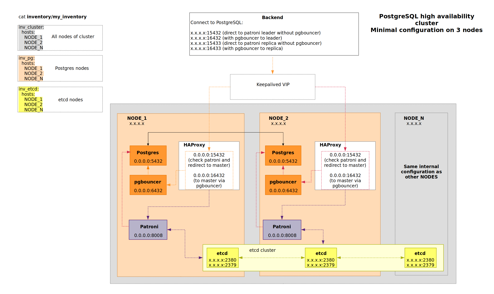

# pg_cluster - HA cluster based on patroni archestration tool

## Project Structure

```
|-- pg-cluster.yaml			            # Main playbook
|-- pki-dir				                # Folder that store generated certs
|   |-- .gitkeep
|-- README.md
|-- inventory
|   |-- group_vars
|   |   |-- etcd.yml
|   |   |-- haproxy.yml
|   |   |-- keepalived.yml
|   |   |-- patroni.yml
|   |   |-- pgbouncer.yml
|   |   |-- prepare_nodes.yml
|   |-- my_inventory
|-- roles
|   |-- certificates					# Role that generate TLS certs for etcd and patroni
|   |   |-- tasks
|   |   |   `-- main.yml
|   |   |-- vars
|   |   |   `-- main.yml
|   |-- etcd					        # Role that installs etcd-tantor-all package
|   |   |-- handlers
|   |   |   `-- main.yml
|   |   |-- tasks
|   |   |   |-- main.yml
|   |   |   |-- pki.yml
|   |   |   |-- cluster_add.yml
|   |   |   |-- cluster_del.yml
|   |   |   |-- cluster_state.yml
|   |   |   `-- systemd.yml
|   |   |-- templates
|   |   |   |-- etcd.conf.j2
|   |   |   `-- etcd-tantor.service.j2
|   |-- haproxy					        # Role that installs haproxy-tantor-all package
|   |   |-- handlers
|   |   |   `-- main.yml
|   |   |-- tasks
|   |   |   `-- main.yml
|   |   `-- templates
|   |       `-- haproxy.cfg.j2
|   |--keepalived                       # Role that installs keepalived-tantor-all package
|   |   |-- check_scripts
|   |   |   `-- chk_patroni_leader.sh
|   |   |-- handlers
|   |   |   `-- main.yml 
|   |   |-- meta
|   |   |   `-- argument_specs.yml
|   |   |-- tasks
|   |   |   `-- main.yml
|   |   `-- templates
|   |       `-- keepalived.conf.j2
|   |-- patroni					        # Role that installs patroni-tantor-all package
|   |   |-- handlers
|   |   |   `-- main.yml
|   |   |-- tasks
|   |   |   `-- main.yml
|   |   `-- templates
|   |       |-- patroni_custom_bootstrap_script.sh.j2
|   |       |-- patroni-tantor.service.j2
|   |       |-- patroni-watchdog.service.j2
|   |       |-- patroni.yml.j2
|   |       `-- walg.json.j2
|   |-- pgbouncer				        # Role that installs pgbouncer-tantor-all package
|   |   |-- handlers
|   |   |   `-- main.yml 
|   |   |-- sql
|   |   |   `-- pgbouncer_prepare.sql	# CREATE SCHEMA pgbouncer and FUNCTION pgbouncer.get_auth
|   |   |-- tasks
|   |   |   `-- main.yml
|   |   `-- templates
|   |       |-- pgbouncer.ini.j2
|   |       `-- pgbouncer.service.j2
|   |-- postgres_classic			    # Role that installs postgresql package
|   |   `-- tasks
|   |       `-- main.yml
|   |-- postgres_tantordb			    # Role that installs tantor-server package
|   |   `-- tasks
|   |       `-- main.yml
|   `-- prepare_nodes			        # Role for installing basic utils
|       `-- handlers
|           `-- main.yml
|       `-- tasks
|           |-- main.yml
|           |-- debian.yml
|           `-- rhel.yml
|-- tools
|   `-- pg_cluster_backend			    # In progress
|       |-- conf 
|       |-- log 
|       |-- psc 
|       `-- pg_cluster_backend.py 
```



# General information

This section describes how to deploy ``pg_cluster`` using ``ansible`` based automation tools.
The following text will present examples of commands to be entered in the terminal to prepare an SSH session, check if the ansible settings are correct and start the playbook. The ``admin_user`` account will be used as an example user. When launching commands in the Customer's loop, this user must be changed to an account that has passwordless SSH access to all servers (virtual machines) specified in the ``my_inventory`` file, as well as access to privileged mode (root). As a result of the playbook operation, a cluster of the selected DBMS (tantordb or postgresql) managed via patroni will be deployed on the servers specified in the ``my_inventory`` file.

## Requirements

Playbook requires the following component's version to be installed:
* Ansible >= 2.9.10 (with collections community.general, community.postgresql, community.crypto)
* Python3 (with pip module) >= 3.10.0
* psycopg2 >= 2.5.1 (it's recommended to install via pip)
* packaging >= 24 (it's recommended to install via pip)

## Host preparation (based on OS Astra Linux 1.7)

1. Create an ``admin_user`` user (executed on each node from the ``inventory`` file):

```bash
sudo adduser admin_user
```

2. Install git (executed on the node from which ansible-playbook will be run):

```bash
sudo apt install git
```

3. Download the project (run on the node from which ansible-playbook will be launched):

```bash
git clone https://github.com/TantorLabs/pg_cluster

cd pg_cluster
```
---
NB: Points from 4 to 5 are optional for cases where the user has already generated an SSH keys. If you do not want to have the SSH keys in a non-standard location, points 4 and 5 can be replaced with the following commands, run as the admin_user account:
```bash
ssh-keygen -t rsa -b 4096
ssh-copy-id admin_user@ip_node (repeat the command for each node in the inventory file)
```
If you have followed the NB part above, please continue from point 6 of the current instruction.

---

4. Generate SSH keys and upload to cluster nodes (run on the node from which ansible-playbook will be launched as admin_user account):

```bash
ssh-keygen -t rsa -b 4096 -C "admin_user" -f /home/admin_user/pg_lab_ansible -q -N ""

cat /home/admin_user/pg_lab_ansible.pub >> /home/admin_user/.ssh/authorized_keys

ssh-copy-id -i /home/admin_user/pg_lab_ansible.pub admin_user@ip_node ( repeat the command for each node in the inventory file)
```

5. Write the connection parameters of each server from the ``inventory file`` for the user ``admin_user`` (run on the node from which ansible-playbook will be launched as admin_user account):

```bash
mkdir -p $HOME/.ssh/

cat >> $HOME/.ssh/config << EOL  
Host xxx.xxx.xxx.xxx  
     Port 22  
     User admin_user  
     PreferredAuthentications publickey  
     StrictHostKeyChecking no  
     IdentityFile /home/admin_user/pg_lab_ansible  
EOL
```

6. Grant the ``admin_user`` user possibility to enter to privileged mode (root) without entering a password (executed on each node from the inventory file).

7. Test the ``ssh`` connection of the ``admin_user`` user (no password should be requested when run and connect as admin_user account):

```bash
ssh admin_user@ip_node
```

## Ansible preparation

Startup preparation is performed on the node from which ansible-playbook will be launched, and includes the following steps:

1. Install ansible

```bash
sudo python3 -m pipX.X install ansible==X.X.X # where X.X(.X) represents the version of pip and Ansible specified in the Requirements block of the current instruction.
```

2. In the ``inventory/group_vars/prepare_nodes.yml`` file, change the value of the ``USERNAME:PASSWORD`` variables to the user name and password to access the Tantor DB repository.

3. In the ``inventory/group_vars/keepalived.yml`` file, change the value of the ``cluster_vip_1`` variable to the IP that will be used by keepalived for the allocated virtual address.

4. Fill in the ``inventory`` file ``inventory/my_inventory``.

After filling in the ``my_inventory`` file, it is recommended to make sure that all servers are available to connect to them via SSH with the required user. To do this, run the following command in the terminal:

```bash
ansible all -i inventory/my_inventory -m ansible.builtin.setup -a "filter=ansible_hostname" -u admin_user
```

The result of the command above will be a response from each of the available servers (virtual machines) in the following format:

```bash
<hostname_from_inventory_file> | SUCCESS => {
    "ansible_facts": {
        "ansible_hostname": "<device_hostname>",
        "discovered_interpreter_python": "/usr/bin/<host_python_version>"
    },
    "changed": false
}
```

This output for each server described in ``my_inventory`` file means successful connection to it via SSH. If as a result of the response from any server (virtual machine) the message differed from the above template - check whether it is possible to connect to it via a key from the user name passed using the ``-u`` flag. If it is necessary to connect only with password entry (without using keys) - it is necessary to add ``-kK`` flags to the command launch and enter the password for SSH connection (``-k`` flag) and for user to switch to privileged mode (root) (``-K`` flag).

Pay attention to the value of the ``ansible_hostname`` variable in the command output. If the value is ``localhost`` or ``localhost.localdomain``, check the ``/etc/hosts`` file of the machines with incorrect output. Ensure that the real device hostname is set **before** localhost on the line containing ``127.0.0.1``.

## Launch Features

The playbook allows the possibility of separating the pg_data, pg_wal and pg_log directories.
If it is necessary to place WAL logs in a separate folder, it is required to make changes to the ``inventory/groupvars/patroni.yml`` file:

* remove the comment for the ``patroni_pg_wal_dir`` variable and specify the directory for placing WAL logs in it;
* for the ``patroni_bootstrap_initdb`` variable add the ``waldir`` parameter and check that it refers to the ``patroni_pg_wal_dir`` variable;
* for the selected replica creation method (by default ``patroni_pg_basebackup``) add ``waldir`` parameter with ``bulk_wal_dir`` value;

In case it is necessary to place LOGs:

* remove the comment for the variable ``patroni_pg_pg_log_dir`` and in it specify the directory for placing LOG logs;

## Playbook launch

One of the playbook tasks is executed on the same node from which ansible is launched (control server). In case the user under which ansible is run does not have passwordless access to root mode on this server, it is necessary to add the ``-K`` flag to the start command and enter the password. 

By default, the playbook does not attempt to connect to Tantor repositories and requires the following packages to be available within the system:

* etcd-tantor-all
* python3-tantor-all
* patroni-tantor-all
* pg_configurator-tantor-all
* haproxy-tantor-all
* keepalived-tantor-all
* pgbouncer-tantor-all
* wal-g-tantor-all
* tantor DBMS

Pay attention to last point from the list above. Tantor package should match environment that is used during playbook launch. For example if you want to install ``tantor-be-server-15`` DBMS using command ``ansible-playbook -i inventory/my_inventory -u admin_user -e "postgresql_vendor=tantordb edition=be major_version=15" pg-cluster.yaml -K`` make sure that package ``tantor-be-server-15`` is available in your local repository.  

If the playbook is run in an environment with internet access, you can leverage the most up-to-date components included in the solution. To do this, add the flag ``add_nexus_repo=true`` and provide the connection details for the repositories in the file ``inventory/group_vars/prepare_nodes.yml``.

---

There are several options to run Ansible: with the option to install TantorDB or classic PostgreSQL as a DBMS.

Use the following command to install TantorDB:

```bash
ansible-playbook -i inventory/my_inventory -u admin_user -e "postgresql_vendor=tantordb edition=be major_version=15" pg-cluster.yaml -K
```

Use the following command to install the PostgreSQL DBMS:

```bash
ansible-playbook -i inventory/my_inventory -u admin_user -e "postgresql_vendor=classic major_version=11" pg-cluster.yaml -K
```

In the commands above, replace the value of the ``major_version`` parameter with the DBMS version to be installed, the value of ``postgresql_vendor`` with the DBMS vendor and the ``admin_user`` parameter with the user who has passwordless access to the servers from the ``my_inventory`` file with the ability to switch to privileged mode (root) without prompting the password. For TantorDB you also need to specify DBMS edition.

## Launch with internet access

It's possible to launch the playbook with external internet access.
```bash
ansible-playbook -i inventory/my_inventory -u admin_user -e "postgresql_vendor=tantordb edition=be major_version=15 add_nexus_repo=true" pg-cluster.yaml -K
```
In that case, make sure that connection details are provided in the file ``inventory/group_vars/prepare_nodes.yml``.

## HOW TO

Below you can find some common commands for working with the software products included in the ``pg_cluster`` solution. Note that the commands and their result may differ depending on the software versions used.

#### Work with etcd:

```bash
# on NODE_1
e_host=(
  /opt/tantor/usr/bin/etcdctl
  --endpoints=https://<HOST_1_IP>:2379,https://<HOST_2_IP>:2379,https://<HOST_N_IP>:2379
  --cacert=/opt/tantor/etc/patroni/ca.pem
  --cert=/opt/tantor/etc/patroni/<NODE1_HOSTNAME>.pem  
  --key=/opt/tantor/etc/patroni/<NODE1_HOSTNAME>-key.pem
)

# list etcd members
ETCDCTL_API=3 "${e_host[@]}" member list --debug

# check version
ETCDCTL_API=3  "${e_host[@]}" version

# get key value ("main" is "patroni_scope")
ETCDCTL_API=3  "${e_host[@]}" get /service/main/config

# cleanup patroni cluster configuration
ETCDCTL_API=3  "${e_host[@]}" del /service/main --prefix
```

#### Manual create user:

```bash
# create user
su - postgres -c "psql -A -t -d postgres -c \"CREATE ROLE replicator WITH REPLICATION LOGIN PASSWORD 'repuserpasswd'\""
# check user
su - postgres -c "psql -A -t -d postgres -c \"select * from pg_roles where rolname = 'replicator'\""
```

#### Manage Patroni Cluster

Patroni includes a command called `patronictl` which can be used to control the cluster. Let`s check the status of the cluster:
```bash
root@node1:~# patronictl -c /opt/tantor/etc/patroni/<NODE1_HOSTNAME>.yml list
+ Cluster: main (7351350415269982209) --+---------+-----------+----+-----------+
| Member  | Host            | Role    | State     | TL | Lag in MB |
+---------+-----------------+---------+-----------+----+-----------+
| node1   | xxx.xxx.xxx.xxx | Leader  | running   |  1 |           |
| node2   | yyy.yyy.yyy.yyy | Replica | streaming |  1 |         0 |
| node3   | zzz.zzz.zzz.zzz | Replica | streaming |  1 |         0 |
+---------+-----------------+---------+-----------+----+-----------+
```
`patronictl -c /opt/tantor/etc/patroni/<NODE1_HOSTNAME>.yml edit-config` should be used only to manage global cluster configuration.
It should not contain any node-specific settings like `connect_address`, `listen`, `data_dir` and so on.

Update DCS `pg_hba` settings:

```bash
cat > pg_hba.conf << EOL
host replication replicator 0.0.0.0/0 md5
local all all  trust
host all all 127.0.0.1/32 trust
host all all localhost trust
EOL

cat pg_hba.conf | jq -R -s 'split("\n") | .[0:-1] | {"postgresql": {"pg_hba": .}}' | \
patronictl -c /opt/tantor/etc/patroni/<NODE1_HOSTNAME>.yml edit-config --apply - --force main

patronictl -c /opt/tantor/etc/patroni/<NODE1_HOSTNAME>.yml show-config
```

Change `postgresql.conf` settings:

```bash
cat > postgresql.conf << EOL
"postgresql": {
"parameters": {
	"max_connections" : 101
}
}
EOL

cat postgresql.conf | patronictl -c /opt/tantor/etc/patroni/<NODE1_HOSTNAME>.yml edit-config --apply - --force main
patronictl -c /opt/tantor/etc/patroni/<NODE1_HOSTNAME>.yml list
patronictl -c /opt/tantor/etc/patroni/<NODE1_HOSTNAME>.yml restart main
```

Make `switchover`:

```bash
root@node1:~# patronictl -c /opt/tantor/etc/patroni/<NODE1_HOSTNAME>.yml switchover
Current cluster topology
+ Cluster: main (7351350415269982209) --+---------+-----------+----+-----------+
| Member| Host            | Role    | State     | TL | Lag in MB |
+-------+-----------------+---------+-----------+----+-----------+
| node1 | xxx.xxx.xxx.xxx | Leader  | running   |  1 |           |
| node2 | yyy.yyy.yyy.yyy | Replica | streaming |  1 |         0 |
| node3 | zzz.zzz.zzz.zzz | Replica | streaming |  1 |         0 |
+-------+-----------------+---------+-----------+----+-----------+
Primary [node1]:
Candidate ['node2', 'node3'] []: node2
When should the switchover take place (e.g. 2024-04-02T13:51 )  [now]:
Are you sure you want to switchover cluster main, demoting current leader node1? [y/N]: y
2024-04-02 12:51:28.04774 Successfully switched over to "node2"
+ Cluster: main (7351350415269982209) --+---------+-----------+----+-----------+
| Member| Host            | Role    | State     | TL | Lag in MB |
+-------+-----------------+---------+-----------+----+-----------+
| node1 | xxx.xxx.xxx.xxx | Leader  | streaming |  2 |           |
| node2 | yyy.yyy.yyy.yyy | Replica | running   |  2 |         0 |
| node3 | zzz.zzz.zzz.zzz | Replica | streaming |  2 |         0 |
+-------+-----------------+---------+-----------+----+-----------+
```

Switch to Asynchronous mode (default mode):

```bash
cat > postgresql.conf << EOL
"postgresql": {
"parameters": {
    "synchronous_commit" : "local"
}
}
"synchronous_mode": false
"synchronous_mode_strict": false
EOL
cat postgresql.conf | patronictl -c /opt/tantor/etc/patroni/<NODE1_HOSTNAME>.yml edit-config --apply - --force main
```

Switch to Synchronous mode:

```bash
cat > postgresql.conf << EOL
"postgresql": {
"parameters": {
    "synchronous_commit" : "remote_apply"
}
}
"synchronous_mode": true
"synchronous_mode_strict": true
EOL
cat postgresql.conf | patronictl -c /opt/tantor/etc/patroni/<NODE1_HOSTNAME>.yml edit-config --apply - --force main
```


Reinit failed node:
In case if output of ``patronictl -c /opt/tantor/etc/patroni/<NODE1_HOSTNAME>.yml list`` provides the information about failed state of the node
```bash
patronictl -c /opt/tantor/etc/patroni/<NODE1_HOSTNAME>.yml list
>>
root@node1:~# patronictl -c /opt/tantor/etc/patroni/<NODE1_HOSTNAME>.yml list
+ Cluster: main (7351350415269982209) --+------------+-----------+----+-----------+
| Member  | Host            | Role    | State        | TL | Lag in MB |
+---------+-----------------+---------+--------------+----+-----------+
| node1   | xxx.xxx.xxx.xxx | Leader  | running      |  1 |           |
| node2   | yyy.yyy.yyy.yyy | Replica | streaming    |  1 |         0 |
| node3   | zzz.zzz.zzz.zzz | Replica | start failed |  1 |         0 |
+---------+-----------------+---------+--------------+----+-----------+
```
failed node can be reconfigured to join the cluster using:
```bash
patronictl -c /opt/tantor/etc/patroni/<NODE1_HOSTNAME>.yml reinit node3
>>
root@node1:~# patronictl -c /opt/tantor/etc/patroni/<NODE1_HOSTNAME>.yml list
+ Cluster: main (7351350415269982209) --+---------+-----------+----+-----------+
| Member  | Host            | Role    | State     | TL | Lag in MB |
+---------+-----------------+---------+-----------+----+-----------+
| node1   | xxx.xxx.xxx.xxx | Leader  | running   |  1 |           |
| node2   | yyy.yyy.yyy.yyy | Replica | streaming |  1 |         0 |
| node3   | zzz.zzz.zzz.zzz | Replica | streaming |  1 |         0 |
+---------+-----------------+---------+-----------+----+-----------+
```

## Cluster test (still in progress)

After successful cluster deployment:
```bash
# on deployment node run test, the test will take about 5 minutes
# please use the latest possible version of python3
# please run commands from the pg_cluster folder
python3 tools/pg_cluster_backend/pg_cluster_backend.py --operations=10000
```

To emulate deadlocks, needs to change parameter `test.accounts = 100 -> 10` in `tools/pg_cluster_backend/conf/pg_cluster_backend.conf`.

Simultaneously with the test, you should perform actions with the cluster:

```bash
# on NODE_1
patronictl -c /opt/tantor/etc/patroni/<NODE1_HOSTNAME>.yml list
patronictl -c /opt/tantor/etc/patroni/<NODE1_HOSTNAME>.yml restart main
shutdown -r now

# on NODE_2
patronictl -c /opt/tantor/etc/patroni/<NODE2_HOSTNAME>.yml list
patronictl -c /opt/tantor/etc/patroni/<NODE2_HOSTNAME>.yml restart main
shutdown -r now

# on NODE_3
patronictl -c /opt/tantor/etc/patroni/<NODE3_HOSTNAME>.yml list
patronictl -c /opt/tantor/etc/patroni/<NODE3_HOSTNAME>.yml restart main
shutdown -r now

# on NODE_1
patronictl -c /opt/tantor/etc/patroni/<NODE1_HOSTNAME>.yml switchover

# on primary node
su - postgres -c "psql -A -t -d test_db -c \"
	select pg_terminate_backend(pid)
	from pg_stat_activity
	where application_name = 'pg_cluster_backend'\""

# on NODE_1
systemctl stop patroni

# on NODE_2
systemctl stop patroni

# on NODE_1
systemctl start patroni

# on NODE_2
systemctl start patroni

# restart all nodes in random order
```

After completing these steps, the test backend should continue work.  
Check how many transaction losses on switchover with asynchronous replication:

```sql
SELECT
	sum(balance)::numeric - -- result balance
	((select count(1) from public.accounts) * 100 + 10000) -- where "--operations=10000"
FROM public.accounts

-- positive value means lost transactions
-- negative value means successfully committed transactions in which the backend received an exception
```


## Links

https://koudingspawn.de/setup-an-etcd-cluster/  
https://lzone.de/cheat-sheet/etcd  
https://coreos.com/os/docs/latest/generate-self-signed-certificates.html  
https://sadique.io/blog/2016/11/11/setting-up-a-secure-etcd-cluster-behind-a-proxy/  
https://github.com/portworx/cfssl-certs  
https://github.com/andrewrothstein/ansible-etcd-cluster  
https://github.com/kostiantyn-nemchenko/ansible-role-patroni  
https://medium.com/code-with-benefit/install-configure-and-secure-postgresql-12-on-ubuntu-18-04-79086bae119e